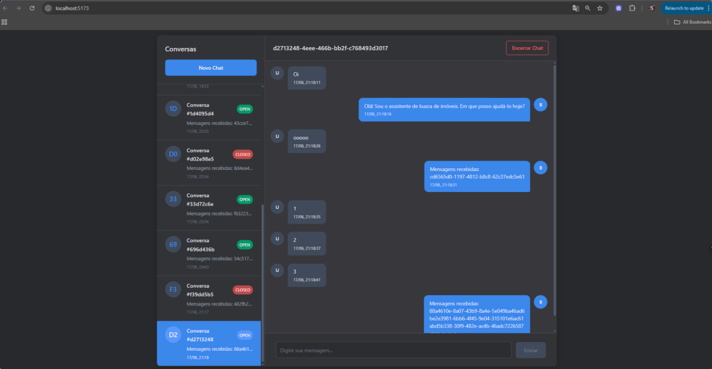

# Guia de Configuração e Inicialização do Ambiente

Este documento detalha os passos necessários para configurar o ambiente de desenvolvimento local e iniciar todos os serviços utilizando Docker Compose.

## Pré-requisitos

Antes de começar, garanta que você tenha as seguintes ferramentas instaladas e funcionando em sua máquina:

-   [Docker](https://www.docker.com/products/docker-desktop/)
-   [Docker Compose](https://docs.docker.com/compose/install/) (geralmente já vem com o Docker Desktop)
-   Um terminal ou linha de comando (ex: Terminal, PowerShell, WSL).

---

## Passo 1: Configuração do Ambiente Backend

A aplicação backend precisa de um arquivo de configuração de ambiente (`.env`) para carregar variáveis essenciais como chaves de API e configurações de banco de dados.

1.  Abra seu terminal e navegue até o diretório do backend do projeto.
    ```bash
    cd backend/
    ```

2.  Copie o arquivo de exemplo `.env.example` para criar um novo arquivo `.env`. Este é o arquivo que a aplicação irá ler.
    ```bash
    cp .env.example .env
    ```

3.  **(Atenção)** Os valores do env.example já estão com os valores que precisam ser utilizado nos container 

## Passo 2: Iniciar os Contêineres com Docker Compose

Com o ambiente configurado, vamos iniciar todos os serviços (backend, frontend, banco de dados, etc.) de uma só vez.

1.  Volte para o diretório raiz do projeto, onde o arquivo `docker-compose.yml` está localizado.
    ```bash
    cd ..
    ```

2.  Execute o comando para iniciar os contêineres.
    ```bash
    docker compose up --build -d
    ```

## Passo 3: Verificar o Status dos Serviços

Após alguns instantes, você pode verificar se todos os contêineres estão rodando corretamente.

1.  Execute o seguinte comando para listar os serviços ativos e seu status:
    ```bash
    docker compose ps
    ```
2.  A saída deve mostrar uma tabela com todos os serviços e seu `State` como `Up` ou `running`.

---



FRONTEND : http://localhost:5173/

BACKEND: http://localhost:8000/

REDIS/CELERY: http://localhost:6379/

DB: http://localhost:5432/
